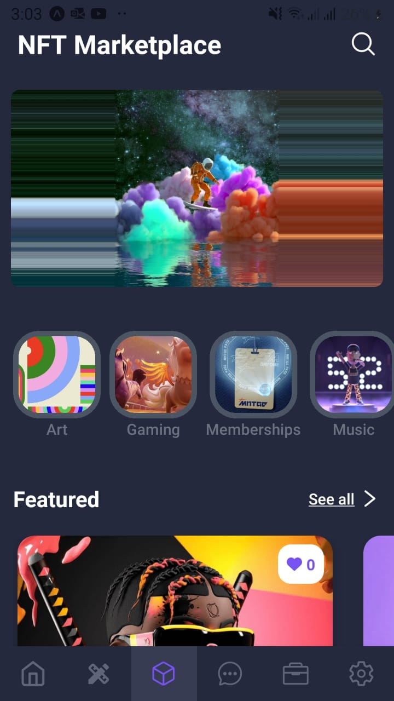
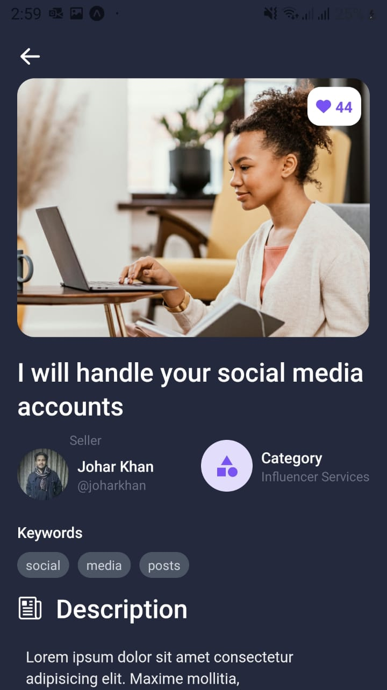
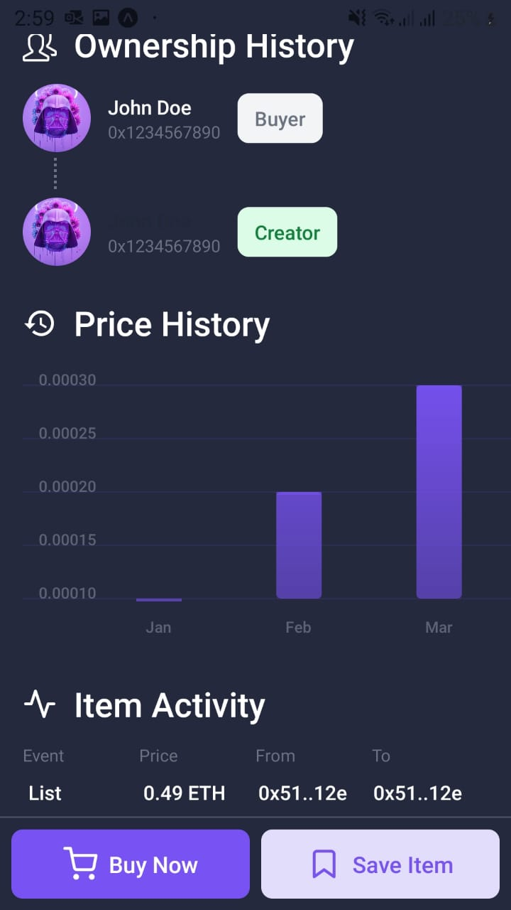
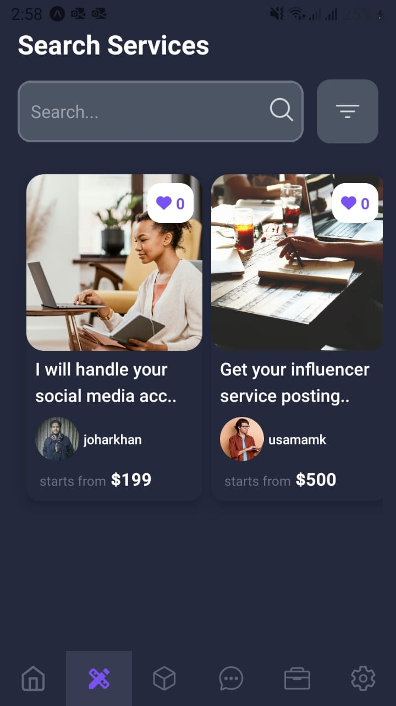
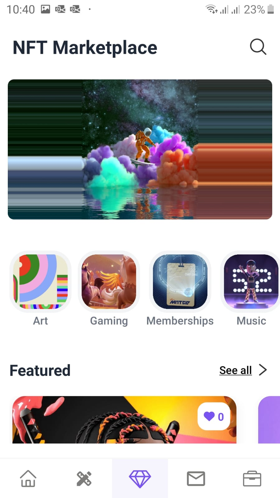

# NFLUENCER Mobile App

NFLUENCER is a digital platform that allows influencers, freelancers, musicians, artists, consultants, and coaches to create and sell gigs that offer their services to buyers. The platform also provides an NFT feature, allowing users to create and sell unique digital assets as add-ons or rewards for their gigs. By integrating with existing NFT marketplaces and providing a user-friendly interface, users can easily create, buy, and sell NFTs on the platform.

The platform provides a convenient and efficient way for users to monetize their skills and creativity, and for buyers to access a wide range of services and products. By creating a community of sellers and buyers, the platform fosters collaboration and innovation, and encourages users to showcase their best work. With its NFT feature, the platform offers a new dimension to the gig economy, allowing users to create and sell digital assets that are both unique and valuable.

## Website Link

[Visit Website](https://nfluencer-website.vercel.app/)

## Play Store Link

Coming Soon!

## Screenshots

  
  
  
  
  
  
  
  
  

